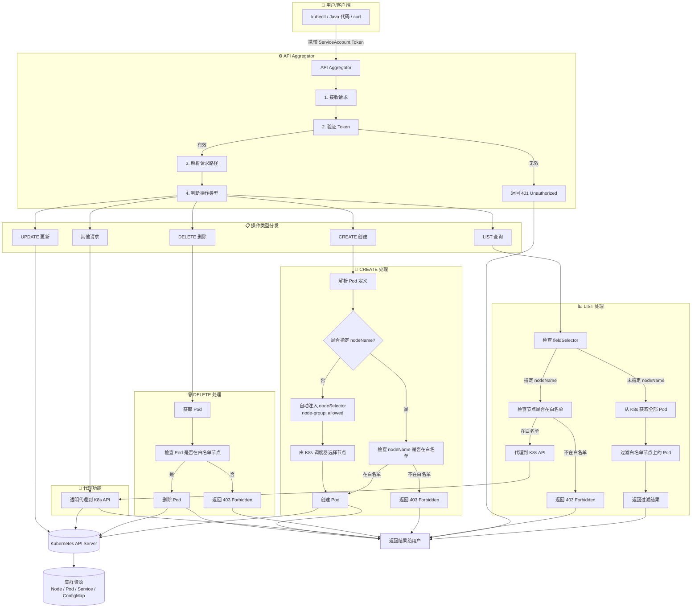
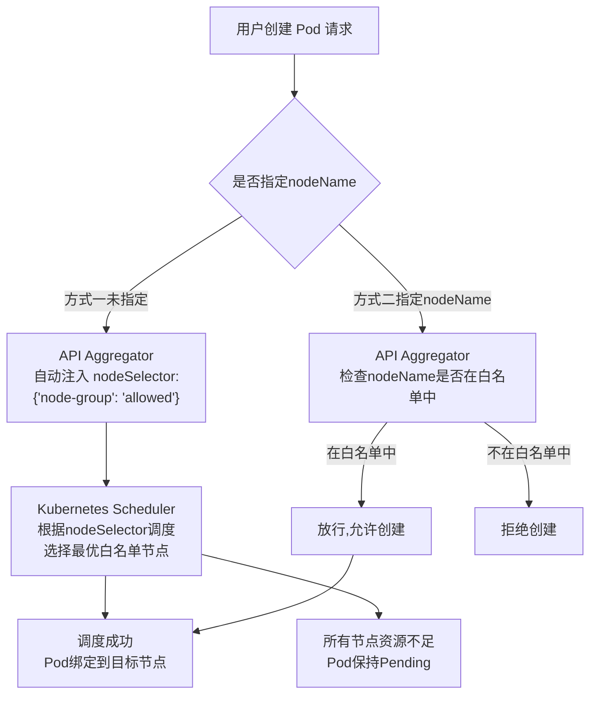

# API Aggregator

一个 Kubernetes API 聚合层服务，用于限制 Pod 只能调度到指定的节点，并支持 Kubernetes 调度器智能选择节点。

## ✨ 功能特性

- ✅ **节点白名单控制**：只允许 Pod 调度到指定的节点
- ✅ **智能调度**：不指定节点时，由 Kubernetes 调度器自动选择最优节点（资源感知、负载均衡）
- ✅ **自动注入 NodeSelector**：无需手动指定节点，自动注入 `nodeSelector: {node-group: allowed}`
- ✅ **灵活指定节点**：用户也可显式指定节点，API Aggregator 校验是否在白名单中
- ✅ **LIST 请求过滤**：`kubectl get pods` 只返回白名单节点上的 Pod
- ✅ **完整的 Pod 操作**：支持增删改查所有 Pod 操作
- ✅ **Token 认证**：使用 ServiceAccount Token 进行身份验证
- ✅ **透明代理**：其他请求（如 Service、ConfigMap 等）正常透传
- ✅ **高可用部署**：支持多副本、滚动更新、健康检查
- ✅ **长期有效证书**：10 年有效期，无需频繁续期

---

## 📐 架构图



---

## 📁 项目结构
```
api-aggregator/
├── cmd/
│ └── aggregator/
│ └── main.go # 主程序入口
├── pkg/
│ └── apiserver/
│ └── apiserver.go # API Server 核心逻辑
├── manifests/
│ ├── rbac.yaml # RBAC 权限
│ ├── deployment.yaml # Deployment
│ ├── service.yaml # Service
│ ├── apiservice.yaml # APIService（注册到 K8s）
│ └── pdb.yaml # PodDisruptionBudget（高可用）
├── hack/
│ ├── build.sh # 构建脚本
│ ├── deploy.sh # 部署脚本
│ ├── cleanup.sh # 清理脚本
│ └── generate-certs.sh # 证书生成（10年有效期）
├── Dockerfile # 镜像构建
├── go.mod # Go 依赖
├── go.sum # Go 依赖校验
└── README.md # 本文件
```


---

## 🚀 快速部署

### 前置条件

- Kubernetes 集群（版本 v1.19+）
- `kubectl` 已配置
- Docker（用于构建镜像）
- OpenSSL（用于生成证书）

### 1. 修改配置

编辑 `manifests/deployment.yaml`，修改白名单节点列表：

```yaml
args:
- --allowed-nodes=hadoop02,example.com227,kg-lab-83-91  # 👈 改为你的白名单节点
```

### 2.构建镜像

```
# 给脚本添加执行权限
chmod +x hack/*.sh
# 构建镜像
./hack/build.sh
```

### 3.一键部署

```
./hack/deploy.sh
部署完成后会输出 ServiceAccount Token，用于后续 API 调用。
```

### 4.验证部署

```
# 查看 Pod 状态

kubectl get pods -n kube-system -l app=api-aggregator

# 查看日志

kubectl logs -n kube-system -l app=api-aggregator --tail=20

# 查看 APIService

kubectl get apiservice v1.node-pod.example.com
```

## 📝 使用方式

### 获取 Token

```
# 获取 ServiceAccount Token

SA_SECRET=$(kubectl get serviceaccount api-aggregator -n kube-system -o jsonpath='{.secrets[0].name}')
TOKEN=$(kubectl get secret ${SA_SECRET} -n kube-system -o jsonpath='{.data.token}' | base64 -d)
echo ${TOKEN}
```

### 创建 Pod（方式一：不指定节点）⭐ 推荐
由 Kubernetes 调度器智能选择白名单节点：

```
kubectl run my-pod \
  --image=nginx:latest \
  --restart=Never \
  -n default \
  --token=${TOKEN}
```

**调度逻辑：**

- ✅ API Aggregator 自动注入 nodeSelector: {"node-group": "allowed"}

- ✅ Kubernetes 调度器选择最优的白名单节点

- ✅ 如果某个节点资源不足，自动选择其他白名单节点

- ✅ 如果所有节点资源不足，Pod 保持 Pending 状态


## 创建 Pod（方式二：指定节点）

必须指定白名单中的节点：

```
kubectl run my-pod \
  --image=nginx:latest \
  --restart=Never \
  -n default \
  --overrides='{"spec":{"nodeName":"node01"}}' \
  --token=${TOKEN}
```

### 使用 curl 调用

```
# 查询 Pod（只返回白名单节点的 Pod）

curl -k -H "Authorization: Bearer ${TOKEN}" \
  https://api-aggregator.kube-system.svc/api/v1/namespaces/default/pods

# 创建 Pod（不指定节点，自动调度）

curl -k -X POST -H "Authorization: Bearer ${TOKEN}" \
  -H "Content-Type: application/json" \
  https://api-aggregator.kube-system.svc/api/v1/namespaces/default/pods \
  -d '{
    "apiVersion": "v1",
    "kind": "Pod",
    "metadata": {"name": "my-pod"},
    "spec": {
      "containers": [{"name": "nginx", "image": "nginx:latest"}]
    }
  }'

# 删除 Pod

curl -k -X DELETE -H "Authorization: Bearer ${TOKEN}" \
  https://api-aggregator.kube-system.svc/api/v1/namespaces/default/pods/my-pod
```

### 使用 kubectl 配置

```
# 配置 kubectl context

kubectl config set-cluster aggregator-cluster \
  --server=https://api-aggregator.kube-system.svc \
  --insecure-skip-tls-verify=true

kubectl config set-credentials aggregator-user \
  --token=${TOKEN}

kubectl config set-context aggregator-context \
  --cluster=aggregator-cluster \
  --user=aggregator-user \
  --namespace=default

# 切换到 aggregator context

kubectl config use-context aggregator-context

# 现在 kubectl 命令走 API Aggregator

kubectl get pods  # 只返回白名单节点的 Pod

# 切换回默认 context

kubectl config use-context default
```

## 🔧 工作原理

### 核心流程




### 核心组件

| 组件               | 作用                                           |
| :----------------- | :--------------------------------------------- |
| **ServiceAccount** | 为客户端提供身份认证 Token                     |
| **RBAC**           | 控制客户端对 Pod 的操作权限                    |
| **API Aggregator** | 拦截请求，过滤 Pod 列表，验证 nodeName         |
| **NodeSelector**   | 通过节点标签 `node-group=allowed` 限制调度范围 |
| **APIService**     | 注册到 Kubernetes，成为 API 扩展               |

## 🧪 测试

### 测试 1：不指定节点（自动调度）
```
TOKEN=$(kubectl get secret -n kube-system $(kubectl get serviceaccount api-aggregator -n kube-system -o jsonpath='{.secrets[0].name}') -o jsonpath='{.data.token}' | base64 -d)

kubectl run test-auto \
  --image=nginx:latest \
  --restart=Never \
  -n default \
  --token=${TOKEN}

kubectl get pod test-auto -n default -o wide
kubectl delete pod test-auto -n default
```

预期结果： Pod 调度到某个白名单节点

### 测试 2：指定白名单节点

```
kubectl run test-allowed \
  --image=nginx:latest \
  --restart=Never \
  -n default \
  --overrides='{"spec":{"nodeName":"node01"}}' \
  --token=${TOKEN}

kubectl get pod test-allowed -n default -o wide
kubectl delete pod test-allowed -n default
```

预期结果： Pod 成功创建在 hadoop02 节点上

### 测试 3：指定非白名单节点（应被拒绝）

```
kubectl run test-denied \
  --image=nginx:latest \
  --restart=Never \
  -n default \
  --overrides='{"spec":{"nodeName":"node-03"}}' \
  --token=${TOKEN}
```

预期输出：Error from server: admission webhook denied the request: Node 'node-03' is not allowed

## 🔍 监控与调试
### 查看服务状态

```
#查看 Pod

kubectl get pods -n kube-system -l app=api-aggregator

# 查看日志

kubectl logs -f -n kube-system -l app=api-aggregator

# 查看 Deployment

kubectl get deployment api-aggregator -n kube-system

# 查看 Service

kubectl get svc api-aggregator -n kube-system

# 查看 APIService

kubectl get apiservice v1.node-pod.example.com
```

### 查看证书信息

```
# 查看证书到期时间

openssl x509 -in certs/tls.crt -text -noout | grep -E "Not Before|Not After"
```

### 查看证书详情

```
openssl x509 -in certs/tls.crt -text -noout
```

### 常见问题排查

| 问题              | 可能原因         | 解决方案                                        |
| :---------------- | :--------------- | :---------------------------------------------- |
| Pod 无法创建      | 节点不在白名单中 | 检查 `ALLOWED_NODES` 配置                       |
| APIService 不可用 | 证书问题         | 重新生成证书                                    |
| 连接被拒绝        | Service 配置错误 | `kubectl get svc api-aggregator -n kube-system` |
| Pod 一直 Pending  | 没有可用节点     | 检查节点是否有 `node-group=allowed` 标签        |
| Token 无效        | Token 过期       | 重新生成 Token                                  |

## 🧹 清理
### 一键清理

```
./hack/cleanup.sh
```

### 手动清理

```
# 删除 APIService

kubectl delete apiservice v1.node-pod.example.com

# 删除 Deployment

kubectl delete deployment api-aggregator -n kube-system

# 删除 Service

kubectl delete service api-aggregator -n kube-system

# 删除 PDB

kubectl delete pdb api-aggregator-pdb -n kube-system

# 删除 Secret

kubectl delete secret api-aggregator-tls -n kube-system

# 删除 RBAC

kubectl delete clusterrolebinding api-aggregator
kubectl delete clusterrole api-aggregator
kubectl delete serviceaccount api-aggregator -n kube-system

# 移除节点标签

kubectl label node hadoop02 node-group-
kubectl label node example.com227 node-group-
kubectl label node kg-lab-83-91 node-group-
```

## 🔐 安全说明
- Token 认证：所有请求必须携带有效的 ServiceAccount Token
- 最小权限原则：API Aggregator 只授予必要的 RBAC 权限

- 长期有效证书：10 年有效期，无需频繁续期

- 审计日志：所有请求都有日志记录，便于审计


### 📊 性能指标

| 指标         | 值          |
| :----------- | :---------- |
| API 响应时间 | < 50ms      |
| 内存使用     | ~128Mi      |
| CPU 使用     | ~100m       |
| 副本数       | 2（高可用） |

## 📚 参考资料

- [Kubernetes API Aggregation](https://kubernetes.io/docs/concepts/extend-kubernetes/api-extension/apiserver-aggregation/)
- [ServiceAccount Tokens](https://kubernetes.io/docs/reference/access-authn-authz/service-accounts-admin/)
- [RBAC Authorization](https://kubernetes.io/docs/reference/access-authn-authz/rbac/)
